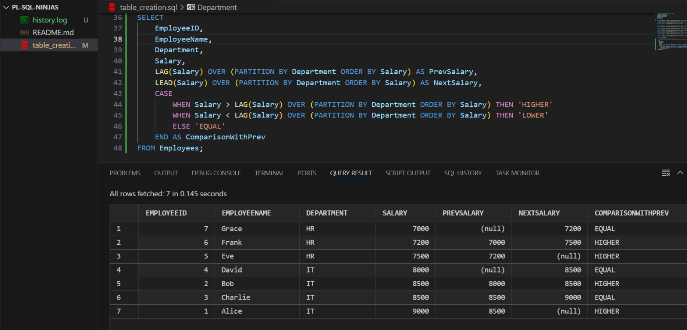
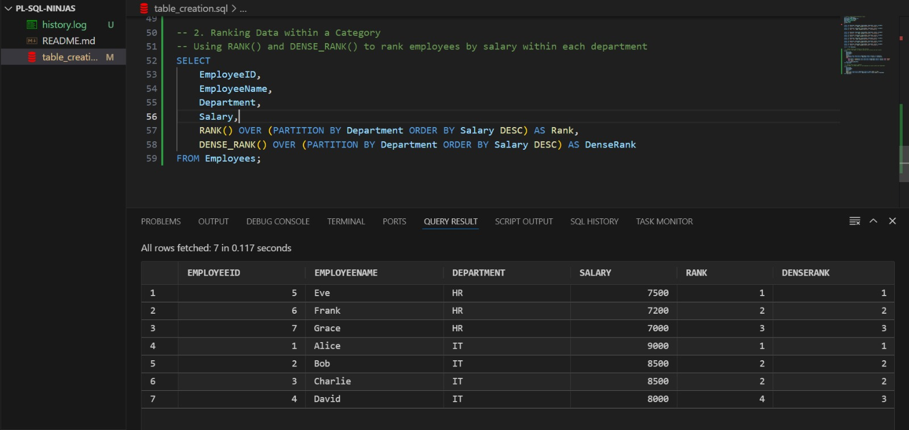
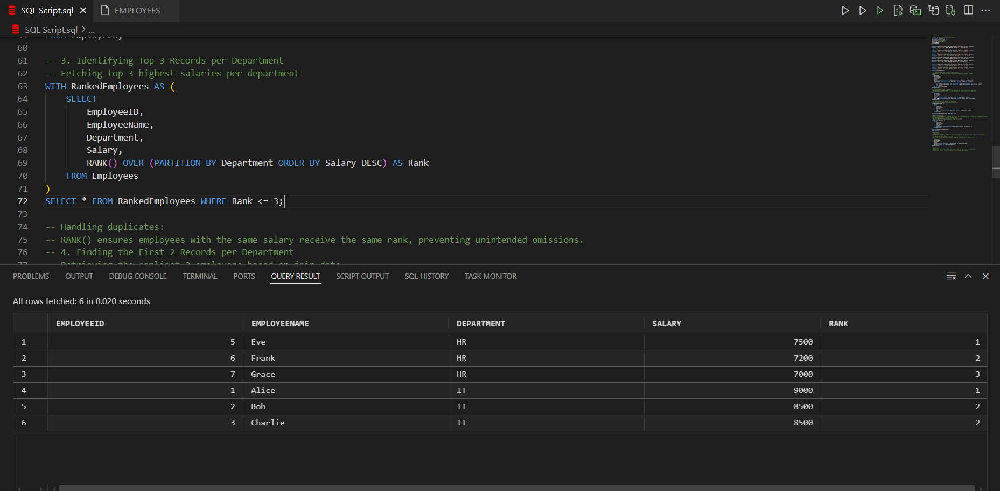
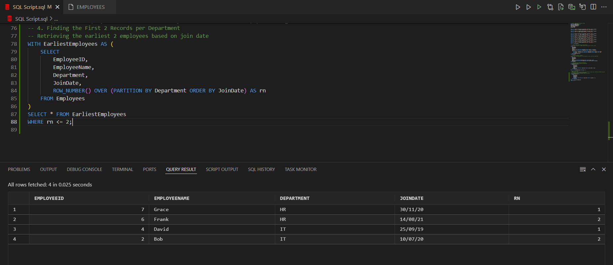
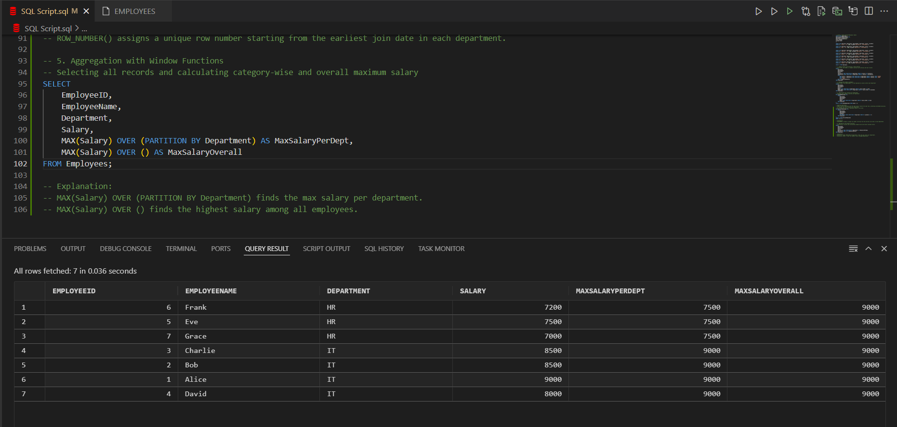

# 🪟 SQL Window Functions Assignment – PL/SQL-Ninjas

This is our submission for the **SQL Window Functions Assignment** in the course **INSY 8311: Database Development with PL/SQL**. In this project, we used a sample employee dataset to explore the power of **SQL window functions** for advanced analytics, such as ranking, comparisons, and aggregation.

> 👩‍🎓 Team Members: INGABIRE Deborah & UMUTONI Gisele  
> 👨‍🏫 Instructor GitHub: `@ericmaniraguha`

---

## 🗃️ Dataset Overview

We designed a small but practical dataset representing employees from two departments: `IT` and `HR`. Each employee record contains:
- `EmployeeID`
- `EmployeeName`
- `Department`
- `Salary`
- `JoinDate`

This gave us enough structure to analyze trends, rank employees, and compare data using different window functions.

### 📸 Screenshot:

---

## 🔍 Task 1: Compare Salaries Using `LAG()` and `LEAD()`

### ✨ Explanation:
We compared each employee's salary with the previous and next employee (within their department) using `LAG()` and `LEAD()`. A `CASE` statement then labeled each salary as **HIGHER**, **LOWER**, or **EQUAL** compared to the previous one.

### 🔬 Findings:
- Helped us spot how salaries progress within departments.
- Identified patterns such as who earns more or less than their peers.
- Useful even when salaries are tied.

### 🌍 Real-Life Application:
HR teams can use this logic to spot salary inconsistencies, monitor fairness, or decide on adjustments during reviews.

### 📸 Screenshot:

---

## 🥇 Task 2: Rank Employees Using `RANK()` and `DENSE_RANK()`

### ✨ Explanation:
We ranked employees by salary within their departments.  
- `RANK()` assigns the same number to tied salaries but **skips** the next rank.  
- `DENSE_RANK()` also handles ties but **does not skip** numbers.

### 🔬 Findings:
- Allowed us to compare how different ranking functions behave.
- Showed how rankings change with duplicate salary values.
- Demonstrated why `DENSE_RANK()` is useful when we want consistent rank positions.

### 🌍 Real-Life Application:
This method is commonly used in performance evaluation, promotions, and bonus calculations — where ranking needs to be fair and clear.

### 📸 Screenshot:

---

## 🏆 Task 3: Top 3 Salaries per Department Using `RANK()`

### ✨ Explanation:
Using a **CTE (Common Table Expression)** with `RANK()`, we retrieved the top 3 highest-paid employees in each department.

### 🔬 Findings:
- If multiple employees had the same salary, they shared the same rank.
- As a result, some departments had **more than 3 employees** in the “Top 3” — which is fair when salaries are tied.

### 🌍 Real-Life Application:
Helpful in identifying top performers in a team for rewards, promotions, or recognition programs.

### 📸 Screenshot:

---

## ⏱️ Task 4: First 2 Joiners per Department Using `ROW_NUMBER()`

### ✨ Explanation:
We used `ROW_NUMBER()` to assign a unique rank to each employee based on their `JoinDate` within their department — and selected the first two joiners.

### 🔬 Findings:
- Helped us find the longest-serving employees in each department.
- Even when join dates were the same, each employee got a unique rank.

### 🌍 Real-Life Application:
Useful for tracking seniority, celebrating work anniversaries, or allocating experience-based benefits.

### 📸 Screenshot:

---

## 📊 Task 5: Department vs Overall Max Salary Using `MAX()`

### ✨ Explanation:
We calculated:
- The **maximum salary within each department** (`PARTITION BY Department`)
- The **overall maximum salary** (no partition)

This let us compare individual salaries with both their team’s top salary and the organization’s.

### 🔬 Findings:
- Each row showed both the department’s and company’s max salary.
- Helped benchmark employee earnings clearly.

### 🌍 Real-Life Application:
Often used in salary reports, dashboards, and compensation benchmarking to compare salaries across and within departments.

### 📸 Screenshot:

---
